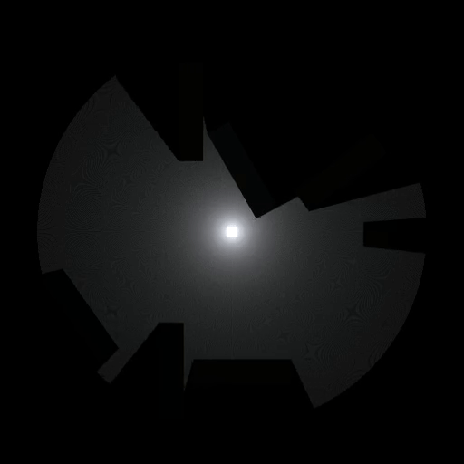

# 2d-raytracing
Ray tracing, but in 2D!
I was using this concept of using raycasts to simulate a ray traced environment in 2d using Unity's low level graphics library (GL), but later abandoned the project when I discovered that 2d lights in a forward 2d renderer (in URP) gave the same look much more efficiently. I tried optimising this by converting the rays into a mesh but still it wasn't much efficient, I'll share that code too.  
A [game](https://makra.itch.io/two-opposites) that used this concept!  
  
1. CLone
2. Add the camera as the player sprite's child.
3. Add raytracing.cs to the camera.
4. Adjust and assign the parameters in the inspector.
5. If you want the surrounding to react to the rays naturally, add colorChange.cs to them.
6. The plyaer controller has been commented out (just in case if have written yours). Else you can simply remove the commented Update & Fixed Update function in raytracing.cs to use this controller. 

